# HeartBeat 🎵💜

Aplikacja webowa typu *music-based dating* — łączy ludzi na podstawie ich gustu
muzycznego. Użytkownik podpina swoje konto **Spotify**, aplikacja pobiera jego
ulubionych artystów, utwory i gatunki, a następnie wylicza dopasowanie muzyczne
(*music sync*) z innymi osobami i podsuwa kandydatów do swipe'owania
(LIKE / PASS). Wzajemny LIKE tworzy *match*.

Projekt zrealizowany w ramach przedmiotu **Wstęp do Programowania Aplikacji
Internetowych (WdPAI)** — własny, lekki framework MVC w czystym PHP, bez
zewnętrznych bibliotek aplikacyjnych.

---

## Spis treści

- [Funkcjonalności](#funkcjonalności)
- [Stos technologiczny](#stos-technologiczny)
- [Architektura](#architektura)
- [Role i uprawnienia](#role-i-uprawnienia)
- [Struktura katalogów](#struktura-katalogów)
- [Baza danych](#baza-danych)
- [Bezpieczeństwo](#bezpieczeństwo)
- [Uruchomienie](#uruchomienie)
- [Konfiguracja Spotify](#konfiguracja-spotify)
- [Routing / endpointy](#routing--endpointy)
- [Konto administratora i dane testowe](#konto-administratora-i-dane-testowe)
- [Uwagi i znane ograniczenia](#uwagi-i-znane-ograniczenia)

---

## Funkcjonalności

- **Rejestracja i logowanie** z walidacją oraz silnym hashowaniem haseł.
- **Onboarding** — uzupełnienie profilu (bio, data urodzenia, płeć, preferencje,
  social handle) oraz wymóg podłączenia konta Spotify.
- **Integracja ze Spotify (OAuth 2.0)** — pobieranie top artystów, top utworów,
  gatunków, ostatnio słuchanych i aktualnie odtwarzanego utworu.
- **Discover / swipe** — kandydaci dobierani na podstawie wspólnych
  artystów/gatunków/utworów oraz odległości geograficznej; akcje LIKE / PASS.
- **Matche** — wzajemny LIKE tworzy dopasowanie; widok listy matchy i szczegółów
  z wyliczonym *music sync*.
- **Profil użytkownika** i **Ustawienia** (zmiana danych konta, lokalizacji,
  maksymalnego dystansu, ponowna synchronizacja muzyki).
- **Zgłaszanie użytkowników** (reports).
- **Panel administratora** — przegląd statystyk, zgłoszeń, banowanie /
  odbanowywanie użytkowników, zamykanie zgłoszeń.

---

## Stos technologiczny

| Warstwa            | Technologia                                   |
|--------------------|-----------------------------------------------|
| Backend            | PHP 8.3 (FPM), własny framework MVC           |
| Baza danych        | PostgreSQL                                    |
| Serwer WWW         | Nginx 1.17                                    |
| Dostęp do bazy     | PDO (`pdo_pgsql`), zapytania parametryzowane  |
| Frontend           | Szablony PHP (`.html`), czysty CSS, vanilla JS|
| Integracja         | Spotify Web API (OAuth 2.0 Authorization Code)|
| Konteneryzacja     | Docker + Docker Compose                       |
| Narzędzia          | pgAdmin 4 (podgląd bazy)                       |

---

## Architektura

Aplikacja stosuje wzorzec **MVC** z pojedynczym punktem wejścia (*front
controller*):

- `index.php` — bootstrap: konfiguruje obsługę błędów (w produkcji ukrywa
  szczegóły, w razie wyjątku serwuje `500.html`), parsuje ścieżkę i przekazuje
  ją do routera.
- `Routing.php` — mapuje ścieżkę + metodę HTTP na kontroler i akcję (wspiera
  trasy z parametrami przez wyrażenia regularne, np. `matches/{id}`).
- `src/controllers/` — kontrolery dziedziczące po `AppController`, który
  dostarcza wspólną logikę: sesje, CSRF, HTTPS, autoryzacja, renderowanie
  widoków.
- `src/repositories/` — warstwa dostępu do danych; każde repozytorium dziedziczy
  po `Repository` i korzysta z `Database` (PDO).
- `src/services/` — logika domenowa (`MatchScoringService`, `MusicSyncService`).
- `src/providers/` — integracje zewnętrzne (`SpotifyProvider`).
- `public/views/` — szablony widoków oraz strony błędów (`404`, `403`, `500`).

Przepływ żądania:

```
Przeglądarka → Nginx → index.php → Routing → Controller → Repository/Service → PostgreSQL
                                          ↓
                                   render() → View (.html)
```

---

## Role i uprawnienia

System rozróżnia użytkowników na podstawie kolumny `users.role` (wartość
domyślna `USER`). Dostęp do poszczególnych sekcji wymuszają metody bazowego
`AppController`: `requireLogin()`, `requireCompletedOnboarding()` oraz
`requireAdmin()`.

| Rola    | Wartość `role` | Uprawnienia |
|---------|----------------|-------------|
| **Użytkownik** | `USER` (domyślna) | Pełen dostęp do części aplikacyjnej po zalogowaniu i ukończeniu onboardingu: discover/swipe, matche, profil, ustawienia, synchronizacja Spotify, zgłaszanie innych użytkowników. Brak dostępu do panelu admina (próba → **403**). |
| **Administrator** | `ADMIN` | Wszystko co użytkownik **oraz** panel administratora: statystyki, lista zgłoszeń, podgląd zgłoszonego profilu, banowanie/odbanowywanie kont, zamykanie zgłoszeń. Weryfikacja: rola `ADMIN` **i** aktywne konto. |

Nadanie uprawnień administratora odbywa się bezpośrednio w bazie:

```sql
UPDATE users SET role = 'ADMIN' WHERE email = 'twoj@email.com';
```

### Stany konta (niezależne od roli)

Poza rolą na dostęp wpływają dwa stany konta:

- **Aktywne / zablokowane** (`users.is_active`) — konto z `is_active = FALSE`
  (zbanowane przez admina) nie może się zalogować, a istniejąca sesja jest
  natychmiast niszczona przy następnym żądaniu (`requireLogin()` →
  przekierowanie na `/login?blocked=1`). Dotyczy to także kont `ADMIN`.
- **Onboarding ukończony / nieukończony** (`user_profiles.onboarding_completed`
  + wymagane dane profilu i podłączony Spotify) — dopóki onboarding nie jest
  ukończony, `requireCompletedOnboarding()` przekierowuje użytkownika z części
  aplikacyjnej (discover, matche itd.) z powrotem na `/onboarding`.

W praktyce o tym, co użytkownik może zrobić, decyduje kombinacja:
**rola + aktywność konta + status onboardingu**.

---

## Struktura katalogów

```
.
├── index.php                 # Front controller + obsługa błędów
├── Routing.php               # Router
├── Database.php              # Połączenie PDO (PostgreSQL)
├── config.php                # Sekrety i dane dostępowe (ignorowany w gicie)
├── docker-compose.yaml
├── docker/
│   ├── php/Dockerfile        # PHP 8.3-fpm-alpine + rozszerzenia (pdo_pgsql, gd…)
│   ├── nginx/                # Dockerfile + nginx.conf
│   └── db/
│       ├── Dockerfile
│       ├── init/init.sql     # Schemat bazy (uruchamiany przy starcie)
│       └── seed/demo_users.sql
├── src/
│   ├── controllers/          # Security, Discover, Matches, Profile, Settings,
│   │                         # Onboarding, Admin, Reports, App
│   ├── repositories/         # Users, Profiles, Matches, Swipes, Music,
│   │                         # Reports, ProviderAccounts, Repository (bazowa)
│   ├── services/             # MatchScoringService, MusicSyncService
│   └── providers/            # SpotifyProvider
└── public/
    ├── views/                # Szablony + partiale (nav, sidebar, head)
    ├── styles/               # CSS
    └── assets/
```

---

## Baza danych

PostgreSQL. Schemat tworzony automatycznie z `docker/db/init/init.sql` przy
pierwszym starcie kontenera bazy.

### Tabele

| Tabela              | Opis                                                                 |
|---------------------|----------------------------------------------------------------------|
| `users`             | Konta: `email` (unikalny), `password` (hash), `display_name`, `role` (`USER`/`ADMIN`), `is_active`. |
| `user_profiles`     | Profil 1:1 z użytkownikiem: bio, data urodzenia, płeć, `looking_for`, social handle, lokalizacja (`latitude`/`longitude`), `max_distance_km`, `onboarding_completed`. |
| `provider_accounts` | Połączone konta zewnętrzne (Spotify): tokeny dostępu/odświeżania i czas wygaśnięcia. Unikalność `(user_id, provider_key)`. |
| `user_artists`      | Top artyści użytkownika wg `time_range` i rankingu.                   |
| `user_tracks`       | Top utwory użytkownika.                                               |
| `user_recent_plays` | Ostatnio odtwarzane utwory.                                          |
| `user_genres`       | Gatunki z wagą (`weight`) — podstawa dopasowania.                    |
| `user_now_playing`  | Aktualnie odtwarzany utwór (1:1 z użytkownikiem).                     |
| `swipes`            | Akcje swipe: `swiper_id`, `target_id`, `direction` (`LIKE`/`PASS`). Ograniczenia: brak swipe'a na siebie, unikalność pary. |
| `matches`           | Dopasowania (wzajemny LIKE). Wymusza `user_a_id < user_b_id`, unikalność pary. |
| `user_reports`      | Zgłoszenia użytkowników: `reporter_id`, `reported_user_id`, `reason`, `status` (`OPEN`/`RESOLVED`), pola recenzji. |

### Relacje i integralność

- Wszystkie tabele potomne mają **klucze obce** do `users` z `ON DELETE CASCADE`
  (usunięcie konta czyści powiązane dane).
- **Ograniczenia `CHECK`** wymuszają poprawność danych na poziomie bazy
  (np. dozwolone wartości `direction`, `status`, zakaz swipe'a/zgłoszenia na
  samego siebie).
- **Indeksy** na kolumnach często filtrowanych (`email`, `user_id`,
  `swiper_id`/`target_id`, `status`) dla wydajności.

### Diagram ER

Poniższy diagram renderuje się automatycznie na GitHubie (natywne wsparcie dla
Mermaid). `PK` = klucz główny, `FK` = klucz obcy, `UK` = ograniczenie unikalności.

```mermaid
erDiagram
    users ||--o| user_profiles : "ma profil (1:1)"
    users ||--o| user_now_playing : "aktualnie gra (1:1)"
    users ||--o{ provider_accounts : "połączone konta"
    users ||--o{ user_artists : "top artyści"
    users ||--o{ user_tracks : "top utwory"
    users ||--o{ user_recent_plays : "ostatnio słuchane"
    users ||--o{ user_genres : "gatunki"
    users ||--o{ swipes : "swipuje (swiper)"
    users ||--o{ swipes : "jest celem (target)"
    users ||--o{ matches : "user_a"
    users ||--o{ matches : "user_b"
    users ||--o{ user_reports : "zgłasza (reporter)"
    users ||--o{ user_reports : "zgłoszony (reported)"
    users ||--o{ user_reports : "recenzuje (reviewed_by)"

    users {
        serial id PK
        varchar firstname
        varchar email UK
        text password
        varchar display_name
        varchar role "USER / ADMIN"
        boolean is_active
        timestamptz created_at
        timestamptz updated_at
    }

    user_profiles {
        serial id PK
        int user_id FK,UK
        text bio
        date birth_date
        varchar gender
        varchar looking_for
        varchar avatar_path
        varchar instagram_handle
        varchar facebook_handle
        varchar spotify_handle
        double latitude
        double longitude
        int max_distance_km
        boolean onboarding_completed
        timestamptz created_at
        timestamptz updated_at
    }

    provider_accounts {
        serial id PK
        int user_id FK
        varchar provider_key "UK z user_id"
        text access_token
        text refresh_token
        timestamptz token_expires_at
        timestamptz created_at
        timestamptz updated_at
    }

    user_artists {
        serial id PK
        int user_id FK
        varchar provider_key
        varchar time_range
        varchar artist_id "UK w obrębie usera/time_range"
        varchar artist_name
        varchar artist_image_url
        int rank
        timestamptz synced_at
    }

    user_tracks {
        serial id PK
        int user_id FK
        varchar provider_key
        varchar time_range
        varchar track_id "UK w obrębie usera/time_range"
        varchar track_name
        varchar artist_name
        varchar album_name
        varchar album_image_url
        int duration_ms
        varchar spotify_url
        int rank
        timestamptz synced_at
    }

    user_recent_plays {
        serial id PK
        int user_id FK
        varchar provider_key
        varchar track_id
        varchar track_name
        varchar artist_name
        varchar album_name
        varchar album_image_url
        timestamptz played_at
        timestamptz synced_at
    }

    user_genres {
        serial id PK
        int user_id FK
        varchar provider_key
        varchar genre "UK z user_id/provider"
        int weight
        timestamptz synced_at
    }

    user_now_playing {
        serial id PK
        int user_id FK,UK
        varchar track_id
        varchar track_name
        varchar artist_name
        varchar album_image_url
        varchar spotify_url
        boolean is_playing
        timestamptz updated_at
    }

    swipes {
        serial id PK
        int swiper_id FK
        int target_id FK
        varchar direction "LIKE / PASS"
        timestamptz swiped_at
    }

    matches {
        serial id PK
        int user_a_id FK "CHECK: user_a_id mniejszy niz user_b_id"
        int user_b_id FK
        timestamptz matched_at
    }

    user_reports {
        serial id PK
        int reporter_id FK
        int reported_user_id FK
        varchar reason
        varchar status "OPEN / RESOLVED"
        int reviewed_by FK "nullable"
        timestamptz reviewed_at
        varchar action_note
        timestamptz created_at
        timestamptz updated_at
    }
```



### Dopasowanie muzyczne

Logika w `src/services/MatchScoringService.php` liczy *music sync* (0–100) jako
ważoną sumę trzech składowych: wspólnego gustu (`0.40`), zgodności gatunków
(`0.35`) i „vibe” (`0.25`), z wagami zależnymi od zakresu czasowego danych
Spotify. Dobór kandydatów w `UsersRepository::getDiscoverCandidatesForUser`
dodatkowo uwzględnia odległość geograficzną (wzór haversine w SQL),
preferencję `looking_for` i wyklucza już oswipe'owanych.

---

## Bezpieczeństwo

Poniżej lista wdrożonych mechanizmów wraz ze wskazaniem, gdzie znajdują się
w kodzie.

### Uwierzytelnianie i hasła

- **Hashowanie haseł** — `password_hash()` z algorytmem **bcrypt**; weryfikacja
  przez `password_verify()`. Hasła nigdy nie są przechowywane jawnie.
- **Walidacja złożoności hasła** — min. 8 znaków, mała i wielka litera, cyfra
  oraz znak specjalny (`isStrongPassword()`).
- **Brak ujawniania istnienia konta** — przy błędnym logowaniu zawsze ten sam
  komunikat („Nieprawidłowy email lub hasło”), niezależnie od tego, czy email
  istnieje.
- **Sprawdzanie unikalności emaila** przy rejestracji (`getUserByEmail`), a przy
  edycji konta `emailExistsForOtherUser`.
- **Walidacja formatu emaila po stronie serwera** — `filter_var(...,
  FILTER_VALIDATE_EMAIL)`.
- **Ograniczenie długości wejścia** — email ≤ 255, hasło ≤ 128, nazwa ≤ 50 (limit
  egzekwowany serwerowo, nie tylko w HTML).

### Sesje i ciasteczka

- **Regeneracja ID sesji** po poprawnym logowaniu — `session_regenerate_id(true)`
  (ochrona przed *session fixation*).
- **Ciasteczko sesyjne**: flagi **HttpOnly**, **Secure** (poza środowiskiem
  lokalnym) oraz **SameSite=Lax** — ustawiane w `AppController::configureSessionCookie`.
- **Poprawne wylogowanie** — `destroyCurrentSession()` czyści `$_SESSION`,
  usuwa ciasteczko i wywołuje `session_destroy()`.

### Ochrona formularzy i transportu

- **Tokeny CSRF** w formularzu logowania i rejestracji (generowane przez
  `bin2hex(random_bytes(32))`, weryfikowane porównaniem stałoczasowym
  `hash_equals`).
- **Wymuszanie HTTPS** dla logowania/rejestracji (`requireHttps()` — przekierowanie
  301; pomijane jedynie dla `localhost`/`127.0.0.1`).
- **Ograniczenie metod HTTP** — `login`/`register` przyjmują dane tylko przez
  **POST**; **GET** wyłącznie renderuje widok. Nieobsługiwane metody → **405**
  z nagłówkiem `Allow`.

### Ochrona przed atakami iniekcyjnymi

- **SQL Injection** — wszystkie zapytania korzystają z **PDO i parametrów
  wiązanych** (`prepare` + `bindParam`/`execute`), bez konkatenacji danych
  wejściowych do SQL. Nieliczne wartości wstawiane do treści zapytania (np.
  `LIMIT`) są wcześniej rzutowane na `int` i ograniczane do bezpiecznego zakresu.
- **XSS** — wszystkie dane wyświetlane w widokach są escapowane przez
  `htmlspecialchars(..., ENT_QUOTES, 'UTF-8')`.

### Ograniczanie nadużyć

- **Limit prób logowania** — po 5 nieudanych próbach blokada czasowa na 5 minut
  (`MAX_LOGIN_ATTEMPTS` / `LOGIN_LOCK_SECONDS`), licznik per kombinacja
  email+IP. Przekroczenie zwraca **429**.
- **Audyt nieudanych logowań** — logowane do logu serwera **bez haseł**
  (zapisywany jest jedynie zahaszowany email, IP, powód i numer próby).

### Obsługa błędów i kody HTTP

- **W produkcji ukryte szczegóły błędów** — `display_errors` wyłączone, własne
  handlery wyjątków/błędów serwują `500.html`; surowe stack trace'y nie trafiają
  do użytkownika.
- **Sensowne kody HTTP** — 400 (błędne dane), 401 (błędne logowanie), 403
  (CSRF / brak uprawnień / konto zablokowane), 405 (zła metoda), 429 (za dużo
  prób).
- **Hasła nie trafiają do widoków** — przekazywany jest wyłącznie token CSRF
  i komunikaty; brak `echo`/`var_dump` wrażliwych danych.

### Minimalizacja danych i autoryzacja

- Z bazy pobierany jest **minimalny zestaw kolumn** o użytkowniku potrzebny w
  danym kontekście (osobne zapytania `getUserById` vs `getAuthUserByEmail`).
- **Kontrola dostępu** — `requireLogin()`, `requireCompletedOnboarding()` oraz
  `requireAdmin()` chronią odpowiednie sekcje; panel admina wymaga roli `ADMIN`
  i aktywnego konta, w przeciwnym razie **403**.
- Konto z `is_active = FALSE` (zbanowane) jest natychmiast wylogowywane i nie
  może się zalogować.

> **Uwaga:** mechanizm CAPTCHA / Cloudflare nie jest zaimplementowany w kodzie —
> ograniczanie prób logowania realizowane jest po stronie aplikacji (blokada
> czasowa oparta o sesję). Jest to świadome uproszczenie projektu studenckiego.

---

## Uruchomienie

### Wymagania

- Docker i Docker Compose.

### Kroki

1. Sklonuj repozytorium:
   ```bash
   git clone <adres-repo>
   cd <katalog-repo>
   ```

2. Utwórz plik `config.php` w katalogu głównym (jest celowo ignorowany przez
   git — patrz `.gitignore`):
   ```php
   <?php
   CONST USERNAME = 'docker';
   CONST PASSWORD = 'docker';
   CONST HOST = 'db';
   CONST DATABASE = 'db';

   CONST SPOTIFY_CLIENT_ID = 'twoj_client_id';
   CONST SPOTIFY_CLIENT_SECRET = 'twoj_client_secret';
   CONST SPOTIFY_REDIRECT_URI = 'http://127.0.0.1:8080/settings/providers/spotify/callback';
   ```

3. Uruchom kontenery:
   ```bash
   docker compose up --build
   ```

4. Schemat bazy zostanie utworzony automatycznie z `docker/db/init/init.sql`.
   Aby załadować dane testowe, wykonaj `docker/db/seed/demo_users.sql`
   (np. przez pgAdmin lub `psql`).

### Adresy

| Usługa             | URL                       |
|--------------------|---------------------------|
| Aplikacja          | http://127.0.0.1:8080     |
| pgAdmin            | http://127.0.0.1:5050     |
| PostgreSQL (host)  | `localhost:5433`          |

Dane logowania do pgAdmin: `admin@example.com` / `admin` (do zmiany w
`docker-compose.yaml`).

---

## Konfiguracja Spotify

1. Załóż aplikację w [Spotify Developer Dashboard](https://developer.spotify.com/dashboard).
2. W ustawieniach aplikacji dodaj **Redirect URI** identyczny z
   `SPOTIFY_REDIRECT_URI`, np. `http://127.0.0.1:8080/settings/providers/spotify/callback`.
3. Skopiuj **Client ID** i **Client Secret** do `config.php`.

Wykorzystywane zakresy (scopes): `user-top-read`, `user-read-recently-played`,
`user-read-private`, `user-library-read`, `user-follow-read`,
`user-read-currently-playing`, `user-read-playback-state`.

---

## Routing / endpointy

| Metoda | Ścieżka                                  | Akcja                              |
|--------|------------------------------------------|------------------------------------|
| GET    | `/`                                      | Strona startowa (landing)          |
| GET/POST | `/login`                               | Logowanie                          |
| GET/POST | `/register`                            | Rejestracja                        |
| POST   | `/logout`                                | Wylogowanie                        |
| GET/POST | `/onboarding`                          | Onboarding (widok / zapis)         |
| GET    | `/discover`                              | Discover (kandydaci)               |
| POST   | `/discover/swipe`                        | LIKE / PASS                        |
| GET    | `/matches`                               | Lista matchy                       |
| GET    | `/matches/{id}`                          | Szczegóły matcha                   |
| GET    | `/profile`                               | Profil                             |
| GET    | `/settings`                              | Ustawienia                         |
| POST   | `/settings/account`                      | Aktualizacja konta                 |
| POST   | `/settings/location`                     | Aktualizacja lokalizacji           |
| POST   | `/settings/distance`                     | Aktualizacja dystansu              |
| POST   | `/settings/sync-music`                   | Ponowna synchronizacja Spotify     |
| GET    | `/settings/providers/spotify/connect`    | Start OAuth Spotify                |
| GET    | `/settings/providers/spotify/callback`   | Callback OAuth Spotify             |
| POST   | `/reports`                               | Zgłoszenie użytkownika             |
| GET    | `/admin`                                 | Panel administratora               |
| GET    | `/admin/reports/{id}`                    | Szczegóły zgłoszonego użytkownika  |
| POST   | `/admin/users/{id}/ban`                  | Ban użytkownika                    |
| POST   | `/admin/users/{id}/unban`                | Odbanowanie                        |
| POST   | `/admin/users/{id}/dismiss-reports`      | Zamknięcie zgłoszeń                |

---

## Konto administratora i dane testowe

- Domyślne konto administratora:
  ```txt
  email: admin@heartbeat.dev
  hasło: Admin123!
  id: 1
  ```

- Rola administratora to `role = 'ADMIN'` w tabeli `users`. Aby nadać uprawnienia
  istniejącemu kontu:
  ```sql
  UPDATE users SET role = 'ADMIN' WHERE email = 'twoj@email.com';
  ```
- Plik `docker/db/seed/demo_users.sql` generuje zestaw profili demonstracyjnych
  (m.in. dane z polskich i sąsiednich miast) do testowania discover/matchy.

---
